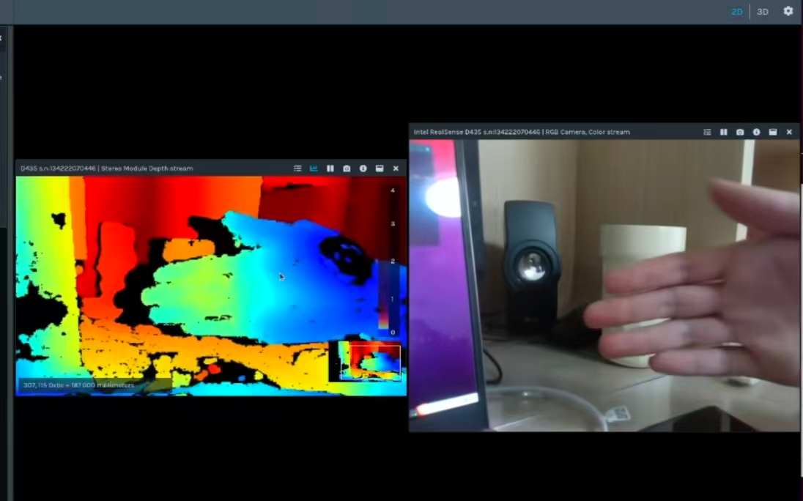
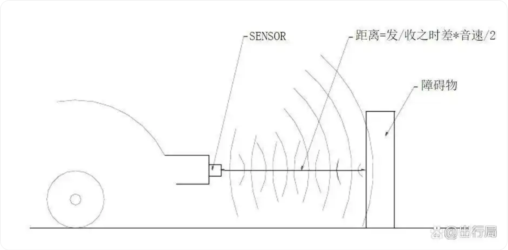
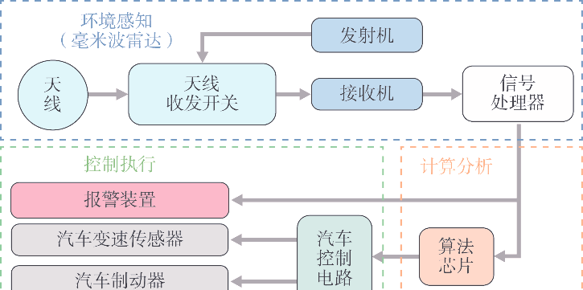

# 实验报告

## 任务一：FR_mid车辆核心硬件和紧急制动

### 一、紧急制动与防撞条
1. **紧急制动按钮**  
   FR_mid车辆紧急制动按钮位于车尾下半部分，外观为圆形红色且印有STOP字样。  
   - 触发方式：出现紧急情况时，按下按钮即可实现紧急制动。  
   - 解除方式：顺时针旋转按钮可解除制动状态。  

2. **防撞条**  
   车辆在车头和车尾均安装防撞条，主要部署于轮胎等高处位置，在发生撞击时可提供一定缓冲作用。

### 二、核心硬件
1. **LiDAR（激光雷达）**  
   激光雷达是现代机器人常用传感器，核心功能为探测周围障碍物的分布情况。  
   - **单线与多线的区别**：测量维度不同（单线为二维，多线可实现三维探测）。  
   - **工作原理**：  
     雷达通过红外激光发射器发射激光，激光接触物体后反射，被接收器捕获。  
     利用计时器记录激光发射到接收的时长，通过公式 `距离 = (光速 × 时长) / 2` 计算与障碍物的距离。  
     雷达通过高频旋转，实时刷新周围障碍物分布信息。

2. **GNSS/IMU（组合导航系统）**  
   由GNSS（全球导航卫星系统）和IMU（惯性测量单元）组成，通过优势互补实现高精度、高可靠性定位导航，广泛应用于自动驾驶、无人机等领域。  
   - **各自局限性**：  
     - GNSS：遮挡环境（高楼、隧道等）中信号易丢失，高动态场景下定位精度下降。  
     - IMU：自主式导航，不依赖外部信号，但存在累积误差（积分计算导致误差随时间放大）。  
   - **组合优势**：  
     - IMU在GNSS信号失效时通过惯性推算维持导航连续性。  
     - GNSS可实时校准IMU，修正累积误差，提升长时间导航精度。  
   - **工作原理**：  
     - GNSS模块通过接收卫星信号解算绝对位置和速度。  
     - IMU模块通过陀螺仪和加速度计测量角速度和加速度，计算位置变化。  
     - 预处理偏差数据后，通过数据融合算法融合二者信息，输出更精确的位置。

3. **感知摄像头** 
   
   核心功能是将光信号转换为数字图像并用于环境理解，负责捕捉目标、识别语义与定位，常与雷达/激光雷达互补，是自动驾驶等场景的“视觉核心”。  
   - **工作原理**：  
     物体反射的可见光经镜头、红外滤光片（过滤杂光）后，聚焦到CMOS/CCD图像传感器的感光阵列。  
     像素根据光照强度产生电荷（光越强电荷越多），电荷经放大后由ADC转为数字信号，经ISP处理输出标准图像格式。  
     通过MIPI、以太网等接口传输至计算平台，平台通过AI算法提取车道线、车辆等信息，输出3D位置、速度等感知结果。  
   - **常见类型**：  
     - 单目摄像头：成本低、易部署，适合基础ADAS（车道偏离预警等），依赖标定与算法。  
     - 双目/多目摄像头：无需主动光源，深度精度高，适合高阶自动驾驶的近距离感知。  
     - 环视摄像头（鱼眼/广角）：覆盖车身360°，用于自动泊车、环视影像。  
     - 红外/夜视摄像头：主动补光，提升暗光和雨雾天感知能力。

4. **超声波雷达** 
   
   核心价值是解决近距离（0.1~5米）感知盲区，弥补摄像头、毫米波雷达在短距场景的不足。  
   - **工作原理**：  
     发射探头发出40kHz左右的超声波，声波遇障碍物反射后被接收探头捕捉。  
     系统记录发射到接收的时间差`t`，通过公式 `距离 = (声速 × 时间差) / 2` 计算与障碍物的距离。

5. **毫米波雷达**  
  
   利用毫米波频段电磁波实现目标探测、测距、测速、测角，工作频段通常为24GHz、77GHz、79GHz，具有穿透性强、抗环境干扰的特点。  
   核心价值是全天候、全场景的中远距离感知，弥补摄像头、超声波雷达的短板，适合复杂环境探测。  
   - **工作原理**：  
     - 测距：发射毫米波信号，接收反射回波，通过 `距离 = (光速 × 时间差) / 2` 计算距离（时间差为信号发射到接收的时长）。  
     - 测速：利用多普勒效应，通过发射信号与回波信号的频率差计算目标相对速度（频率差越大，速度越快）。  
     - 测角：通过多天线阵列的相位差分析，确定目标的方位角和俯仰角，定位空间位置。

## 任务二：Apollo 3.0 软件架构与源码映射表

| 模块名称       | 核心功能                                                     | 代码路径               |
|----------------|--------------------------------------------------------------|------------------------|
| Perception     | 识别自动驾驶车辆周围环境，包含障碍物检测、交通灯检测等子模块   | `modules/perception`   |
| Prediction     | 预测感知到的障碍物的未来运动轨迹                               | `modules/prediction`   |
| Routing        | 规划自动驾驶车辆到达目的地的车道/道路路径                       | `modules/routing`      |
| Planning       | 规划自动驾驶车辆的时间与空间行驶轨迹                           | `modules/planning`     |
| Control        | 生成油门、制动、转向等控制命令，执行规划模块的轨迹             | `modules/control`      |
| CanBus         | 作为软件与车辆硬件的接口，传递控制命令至硬件，回传底盘信息     | `modules/canbus`       |
| Map            | 提供道路结构化信息，作为查询引擎支持（非消息发布订阅模式）     | `modules/map`          |
| Localization   | 融合GPS、LiDAR、IMU等信息，确定自动驾驶车辆的位置               | `modules/localization` |
| HMI（DreamView）| 查看车辆状态、测试模块功能、实时控制车辆的可视化交互模块       | `modules/dreamview`    |
| Monitor        | 监控车辆所有模块（含硬件）的运行状态                           | `modules/monitor`      |
| Guardian       | 安全干预模块，监控并干预系统故障，执行操作中心功能             | `modules/guardian`     |
| Calibration    | 传感器（如摄像头、雷达）的标定模块，确保感知数据精度           | `modules/calibration`  |
| Drivers        | 各类传感器（如激光雷达、摄像头）的驱动模块，负责硬件数据采集   | `modules/drivers`      |

### 自用：Apollo 3.0 目录结构

#### 一、核心文件夹（编译/构建相关）
- `bazel-*` 系列（`bazel-apollo`/`bazel-bin`/`bazel-genfiles`/`bazel-out`/`bazel-testlogs`）：  
  由Bazel构建工具生成（Apollo使用Bazel管理编译）：  
  - `bazel-bin`：存放编译后的可执行文件、二进制程序。  
  - `bazel-genfiles`：存放编译过程中自动生成的文件（如protobuf文件）。  
  - `bazel-out`：编译输出的中间文件、缓存。  
  - `bazel-testlogs`：单元测试的日志和结果。

#### 二、功能模块文件夹
- `data`：存放Apollo运行所需数据文件（地图数据、传感器标定数据、测试数据集等）。  
- `docker`：Docker镜像配置文件，用于快速搭建开发/运行环境（解决环境依赖问题）。  
- `docs`：项目文档资料（开发指南、API说明、功能介绍等）。  
- `modules`：Apollo核心功能模块（自动驾驶关键代码，如感知、规划、控制等）。  
- `py_proto/modules`：Python版本的Protobuf文件（用于模块间数据通信格式定义）。  
- `scripts`：辅助脚本（一键启动、环境配置、数据处理的Shell/Python脚本等）。  
- `third_party`：第三方依赖库（开源算法库、工具包等外部代码）。  
- `tools`：开发/编译用的工具脚本（代码检查、构建辅助工具等）。

#### 三、根目录文件
- `.clang-format`：C/C++代码格式化规则配置（统一代码风格）。  
- `.gitignore`：Git版本管理的忽略文件（指定不提交到仓库的文件）。  
- `apollo_docker.sh`/`apollo.sh`：一键启动/管理Apollo环境的脚本（如启动Docker容器、运行时）。  
- `AUTHORS.md`/`CONTRIBUTING.md`：贡献者名单、代码贡献规范说明。  
- `BUILD`：Bazel构建配置文件（定义项目编译规则）。  
- `README_cn.md`/`README.md`：项目说明文档（中/英文，介绍Apollo及快速上手指南）。  

**说明**：Apollo目录中，Bazel相关文件夹负责编译，`modules`是核心功能代码，`docker`/`scripts`为环境/运行工具，其余为配置、文档、依赖库。
